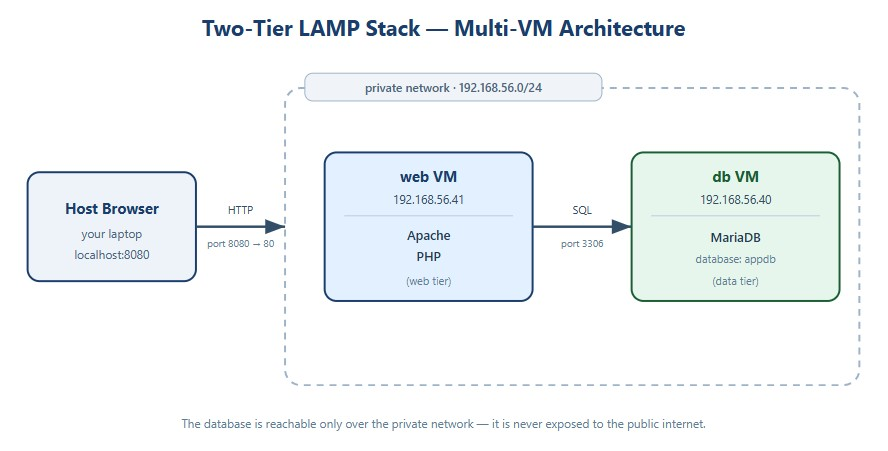
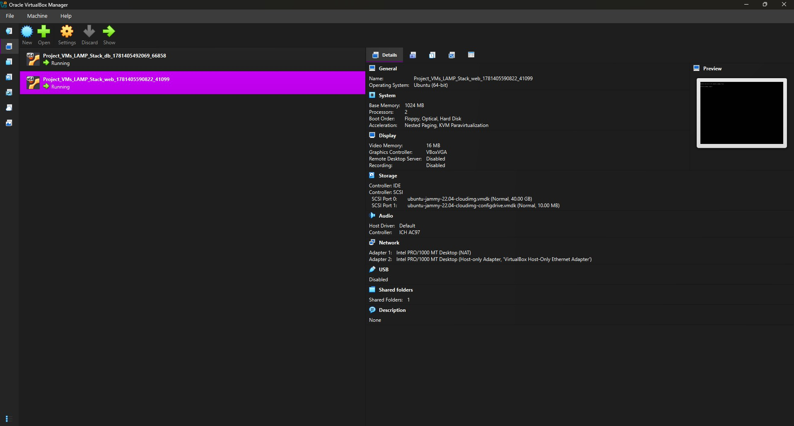
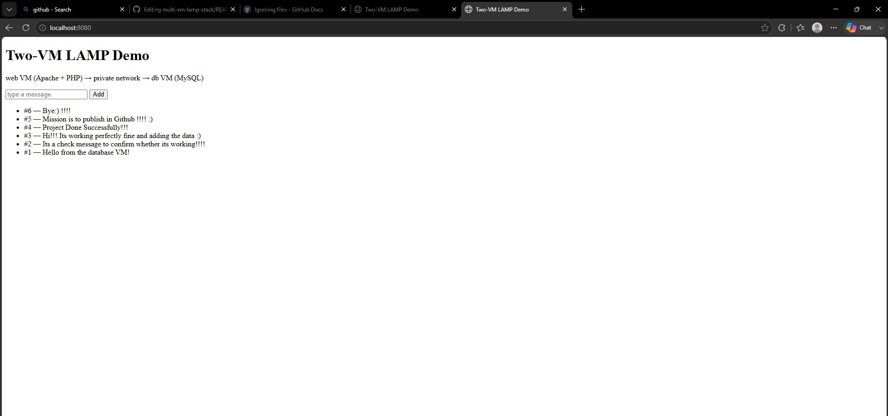

# Two-Tier LAMP Stack Deployment (Multi-VM)

## Overview
This project demonstrates deploying a classic LAMP stack split across two virtual machines on a private network. The web tier (Apache + PHP) runs on one VM and connects to the data tier (MariaDB) on a separate VM. The VMs were provisioned with Vagrant and configured manually via SSH. 

## Project Description
A small PHP application ("messages" demo) was deployed across two Ubuntu VMs to show a real two-tier architecture. The workflow follows:
- Provisioning two VMs (db and web) with Vagrant on a private network
- Connecting to each VM via SSH
- Installing and configuring MariaDB on the database VM
- Opening MariaDB to the private network and creating a database, user, and table
- Installing and configuring Apache2 + PHP on the web VM
- Deploying the PHP page to Apache's web root (`/var/www/html`)
- Verifying the web VM connects to the database VM across the private network
- Confirming the site was live in the browser

## 🛠️ Tech Stack
- ☁️ Infrastructure: Vagrant + Oracle VirtualBox (Infrastructure as Code)
- 🐧 Operating System: Ubuntu 22.04 LTS
- 🌐 Web Server: Apache2
- 🐘 Language: PHP
- 🗄️ Database: MariaDB
- 🔐 Access Method: SSH
- 🔗 Networking: Private (host-only) network

## Architecture

## Steps Followed
1. Created two VMs (`db` and `web`) on a private network using a Vagrantfile:
   - vagrant up

2. Connected to the database VM via SSH:
   - vagrant ssh db

3. Installed MariaDB:
   - sudo apt update && sudo apt install mariadb-server -y

4. Opened MariaDB to the private network by editing `bind-address`:
   - sudo nano /etc/mysql/mariadb.conf.d/50-server.cnf
   - changed `bind-address = 127.0.0.1` to `bind-address = 0.0.0.0`
   - sudo systemctl restart mariadb

5. Created the database, user, and table:
   - CREATE DATABASE appdb;
   - CREATE USER 'appuser'@'192.168.56.%' IDENTIFIED BY 'apppass123';
   - GRANT ALL PRIVILEGES ON appdb.* TO 'appuser'@'192.168.56.%';
   - created the `messages` table and seeded one row

6. Connected to the web VM via SSH:
   - vagrant ssh web

7. Installed Apache2 and PHP:
   - sudo apt update
   - sudo apt install apache2 php libapache2-mod-php php-mysql -y

8. Deployed the PHP page into Apache's web root:
   - placed `index.php` in /var/www/html/ (pointing at the db VM's IP, 192.168.56.40)

9. Verified Apache was running:
   - systemctl status apache2

10. Confirmed the cross-VM connection from the web VM:
    - mysql -h 192.168.56.40 -u appuser -p appdb

11. Visited http://localhost:8080 in a browser to confirm the site was live and reading data from the database VM

## 📸 Screenshots

### Virtual Machines Running

### Website Running

## Key Takeaways
- Gained hands-on experience provisioning two VMs with Vagrant (Infrastructure as Code)
- Built a two-tier architecture with web and database tiers on separate machines
- Configured a private (host-only) network so the VMs communicate without touching the public internet
- Changed MariaDB's `bind-address` to allow remote (cross-VM) database connections
- Applied least privilege by scoping the database user to the `192.168.56.%` subnet
- Kept the database off the public path — only the web VM can reach it
- Used prepared statements (SQL-injection safe) and output escaping (XSS safe) in the PHP
- Excluded machine state and private keys (`.vagrant/`) from version control
